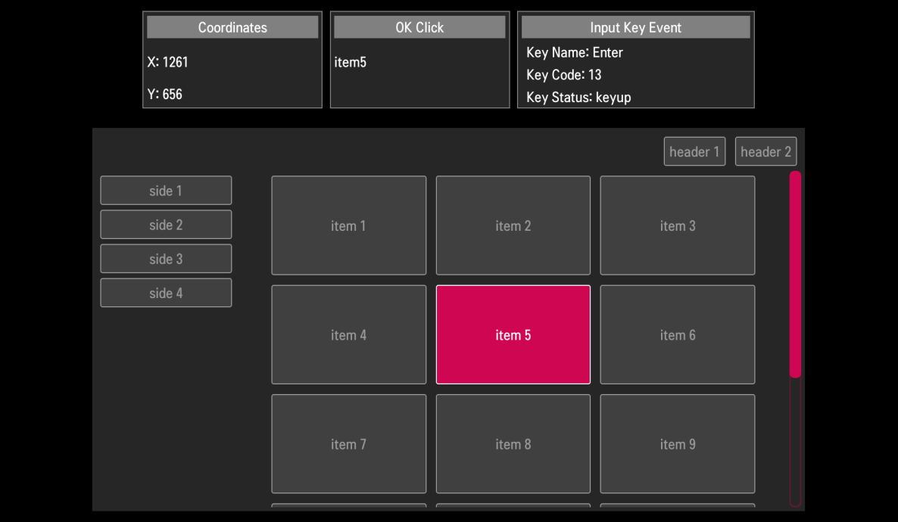

# Remote Control

This sample app shows how to handle user inputs such as magic remote control, conventional remote control, and external keyboard. You can figure out the whole keycodes of the remote control with this sample.
For more information about magic remote control,
see [Magic Remote](https://webostv.developer.lge.com/develop/guides/magic-remote/).

## Basic Remote Control Behavior

The following list describes the basic processing principles for user inputs of the Remote Control.

- Selectable UI elements must be fully navigable by the screen cursor and 4-way navigation keys (Up, Down, Left, and Right)
- Selectable UI elements must act in the same way when controlled by the screen cursor and when controlled by the OK button.
- One of the UI elements must be focused. This is a common mistake that developers make, so check the following:
  - When the cursor disappears from the screen by entering the navigation keys, the focus by the cursor must be switched to the focus by the navigation keys.
  - Contrary to the above, when the cursor is activated and is moving onto a UI element, the focus by the navigation keys must be switched to the focus by the cursor on the current position.
- A selection effect is mandatory to show which element is activated. The possible selection effects are animation, highlight, color, or size change, etc.
- The page and list scroll can be appropriately controlled using the wheel of the Magic Remote.

For more information about UI guidelines, see [UX Checklist](https://webostv.developer.lge.com/distribute/app-self-checklist#ux-self-check-guidelines).

## Adding Event Listeners

### How to Find Key Codes

You can get the key code of key events by adding the `keydown` event listener.

```javascript
document.addEventListener(
  "keydown",
  function (event) {
    console.log("keydown", event.keyCode);
  },
  false
);
```

### How to Handle Magic Remote

When a pointing device (Magic Remote or mouse) is used to move the cursor onto an element or one of its child elements, the `mouseover` event is raised. To handle the `mouseover` event, add the event listener to the document element.

```javascript
document.addEventListener(
  "mouseover",
  function (event) {
    console.log("mouseover", event.target.id);
  },
  false
);
```

## Result in the webOS TV

You can install the sample app and see the sample app result in the webOS TV as in the following image.


## Do's and Don'ts

- **Do** test this sample app on your webOS TV devices or webOS TV Simulator.
- **Don't** try to find the keycode of the TV power key. webOS TV does not provide it.

## Reference

To move focus between UI elements by 4-way navigation keys, [spatial navigation](https://github.com/luke-chang/js-spatial-navigation) is used.
